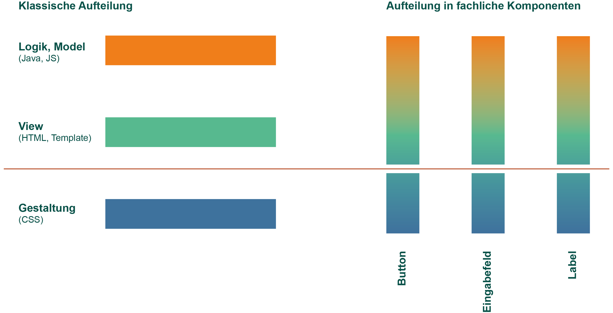

### React Workshop - Vorbereitung

**INSTALLATION**

1.  `git clone https://github.com/reactbuch/react-workshop.git`
    oder
    `git pull` ausführen

2.  Im geklonten Verzeichnis: `npm install`

**STARTEN**

1. Server 1 (Backend): Im geklonten Verzeichnis (react-training): `npm run start-server`
2. Server 2 (Webserver): In `code/workspace`: `npm start`
3. Browser öffnen: http://localhost:8080
4. Wenn dort ein Hello-World-Text erscheint ist alles gut

Folien: TODO

---

## Einführung in React

#### [Nils Hartmann](https://nilshartmann.net) / [@nilshartmann](http://twitter.com/nilshartmann) / [nils@nilshartmann.net](mailto:nils@nilshartmann.net)

---

# Teil 0

## React-Einführung und Build-Prozess

---

## React

[https://reactjs.org](https://reactjs.org)

- f Framework von und für Facebook
- f Eingesetzt u.a. von Microsoft, Paypal, Spotify uvm
- f Minimales API
- f Minimales Feature Set
  - f Ihr könnt/müsst viele Entscheidungen selber treffen
- f Bewusste Verstöße gegen Best-Practices
- f Zentrales Konzept: **Komponenten**

---

## React

_ist sehr stabil_

- f Semantische Versionierung
- f API Änderungen meist abwärtskompatibel

---

### Komponenten in React



---

### Komponenten in React

<!-- .element: class style="font-style: smaller"  -->Unser Beispiel in Komponenten

<!-- .element: class="fragment" style="height: 650px"  -->

---

### React Komponenten

- f bestehen aus **Logik und UI**
- f keine Templatesprache
- f werden **deklarativ** beschrieben
- f werden immer **komplett gerendet** (kein 2-Wege-Data-Binding)
- f werden zu ganzen Anwendungen aggregiert

---

### React Komponenten

- f Werden als **ES6 Klasse** oder **Funktion mit Hooks** (ab React 16.8) implementiert
- f Keine Templatesprache (stattdessen JavaScript)
- f Templates können HTML-artige Syntax enthalten (JSX)

---

### Eine erste Komponente: Hello, World!

[Demo](../../code/schritte/0-hello_world/public/index.html)

- f Beispiel Schritt-für-Schritt (`code/workspace-live-coding`)

---

### Hello World React

```jsx
import React from "react";

export default function HelloMessage(props) {
  const [name, setName] = React.useState(props.initialGreeting || "");

  return (
    <div>
      <input onChange={event => setName(event.target.value)} value={name} />

      <p>{name}, World</p>
      <button onClick={() => setName("")}>Clear</button>
    </div>
  );
}
```

---

### Aufruf

`index.html`

```html
<html>
  <body>
    <div id="mount"></div>
  </body>
  <script src="dist/main.js"></script>
</html>
```

`main.js`

```jsx
import React from "react";
import ReactDOM from "react-dom";

import HelloMessage from "./HelloMessage";

const mountNode = document.getElementById("mount");
ReactDOM.render(<HelloMessage initialGreeting="Hello" />, mountNode);
```

---
