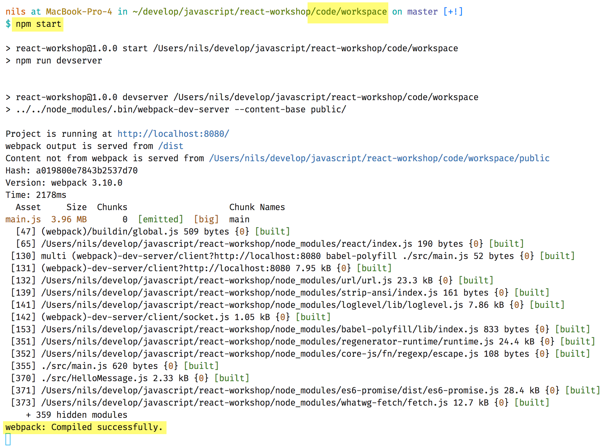

# Einrichten des Workspaces

## Voraussetzungen

Auf den Teilnehmer Laptops sollte installiert sein:

* git (zum installieren des Workspaces)
* nodejs (mind. v8.12.0) und npm 6.4
* Browser (am besten Chrome)
* Eine IDE oder ein Texteditor (Empfehlung: [Webstorm](https://www.jetbrains.com/webstorm/download/) (Evaluationsversion reicht) und/oder [Visual Studio Code](https://code.visualstudio.com/))

## Schritt 1: Repository klonen und Pakete installieren

1. Das Repository klonen:

```
git clone https://github.com/reactbuch/react-workshop
```

2. Im Root-Verzeichnis des geklonten Repositories die npm Pakete installieren:

```
npm install
```

## Schritt 2: Testen, ob's funktioniert

1. Im Root-Verzeichnis des Repositories das Backend starten:

```
npm start-backend
```

Achtung! Das Backend läuft auf **Port 7000**, dh dieser Port muss verfügbar sein.

2. Frontend (Beispiel-Anwendung) starten

Dazu in das Verzeichnis `code/workspace` wechseln und `npm start` ausführen:

```
cd code/workspace

npm start
```

Achtung! Das Frontend läuft auf **Port 8080**, dh dieser Port muss verfügbar sein.



3. Wenn das Frontend gestartet ist, zum testen einmal die Anwendung im Browser aufrufen: [http://localhost:8080](http://localhost:8080). Dort sollte "Hello, World" erscheinen, dann ist der Workspace einsatzbereit.


