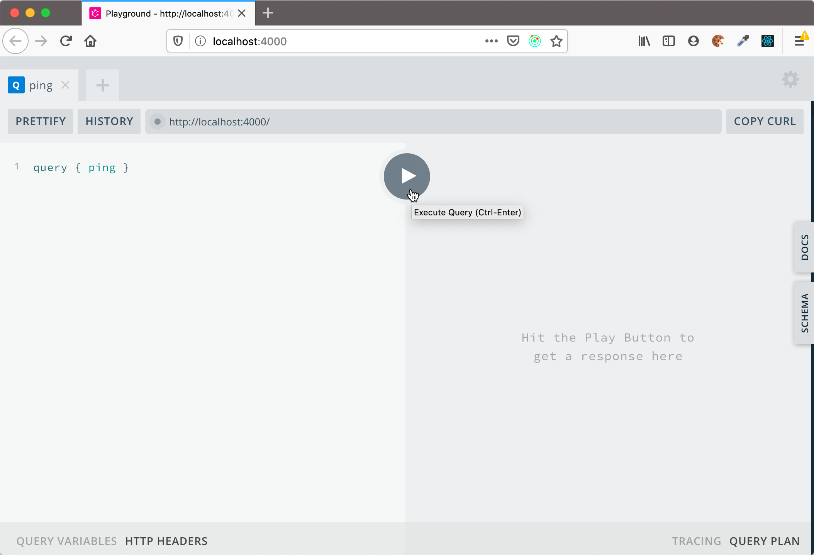
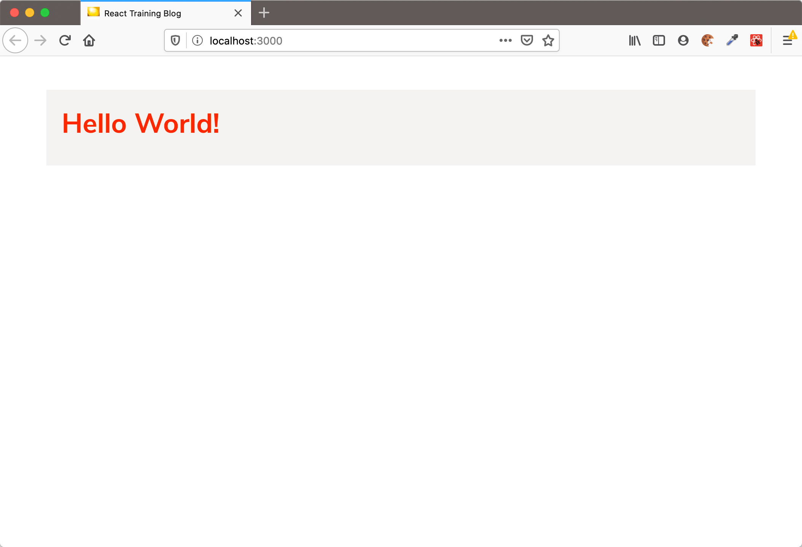

# Vorbereitungen für die React Schulung

## Voraussetzungen

**Teilnehmer Laptops/PCs**

Auf den Teilnehmer Laptops/PCs sollte installiert sein:

- Git (zum installieren des Workspaces)
- [NodeJS](https://nodejs.org/en/download/) (LTS version 12.16.x) und npm Version 6.14.x (ist in der NodeJS Distribution enthalten)
- Browser (am besten Firefox oder Chrome)
- Eine IDE oder ein Texteditor, zum Beispiel:
  - [Visual Studio Code](https://code.visualstudio.com/)
  - [IntelliJ IDEA](https://www.jetbrains.com/idea/download/) (Ultimate Edition, Evaluationsversion reicht aber)
  - [Webstorm](https://www.jetbrains.com/webstorm/download/) (Evaluationsversion reicht)

Die Laptops sollten _auch während des Trainings_ Internet-Zugang haben (s.u.)

Wenn die Teilnehmer bereits ihren "Lieblingseditor" verwenden, sollen sie diesen gerne verwenden, dann müssen sie während des Trainings nicht auch noch einen neuen Editor erlernen.

**Optional: Browser Erweiterungen für React**

- Für das Arbeiten mit React empfehle ich, die [React Developer Tools](https://github.com/facebook/react/tree/master/packages/react-devtools) zu installieren. Es gibt sie für [Chrome](https://www.google.com/url?sa=t&rct=j&q=&esrc=s&source=web&cd=1&cad=rja&uact=8&ved=2ahUKEwjE14vhq-rmAhVGblAKHbgOC1sQFjAAegQICRAK&url=https%3A%2F%2Fchrome.google.com%2Fwebstore%2Fdetail%2Freact-developer-tools%2Ffmkadmapgofadopljbjfkapdkoienihi&usg=AOvVaw3YJDg7kXgeeChgKN88s0Sx) und [Firefox](https://addons.mozilla.org/de/firefox/addon/react-devtools/)

- Für das Arbeiten mit **Apollo GraphQL** gibt es die [Apollo Client Tools](https://www.apollographql.com/docs/react/development-testing/developer-tooling/#apollo-client-devtools), eine Erweiterung für
  [Chrome](https://chrome.google.com/webstore/detail/apollo-client-developer-t/jdkknkkbebbapilgoeccciglkfbmbnfm) und [Firefox](https://addons.mozilla.org/en-US/firefox/addon/apollo-developer-tools/)

**Ausstattung im Schulungsraum**

- Zum Anschluss meines Notebooks benötige ich einen **HDMI-Eingang am Beamer**. Falls der Beamer einen anderen Anschluss hat, gebt mir bitte vorher Bescheid, damit wir eine Lösung finden.

- Zusätzlich zum Beamer sollte ein Whiteboard und/oder ein Flipchart im Schulungsraum vorhanden sein.

# Installation und Vorbereitung des Workspaces für die Schulung

## Schritt 1: Repository klonen und Pakete installieren

1. Das Repository klonen:

```
git clone https://github.com/nilshartmann/react-training
```

2. Testweise die benötigten npm-Pakete installieren:

```
cd blog-example/backend-graphql
npm install

cd blog-example/backend-rest
npm install

cd blog-example/workspace
npm install

cd blog-example/workspace-typescript
npm install
```

## Schritt 2: Testen, ob REST-Backend funktioniert

1. Im Verzeichnis **blog-example/backend-rest** des Repositories das Backend starten:

```
cd blog-example/backend-rest
npm start
```

Achtung! Das Backend läuft auf **Port 7000**, d.h. dieser Port muss verfügbar sein.

2. Backend testen

- Im Browser (oder per curl, wget oder httpie) aufrufen: http://localhost:7000/posts
- Dort sollte JSON Code zurückkommen

## Schritt 3: Testen, ob das GraphQL Backend funktioniert

1. Im Verzeichnis **blog-example/backend-graphql** des Repositories das Backend starten:

```
cd blog-example/backend-graphql
npm start
```

Achtung! Das Backend läuft auf **Port 4000**, d.h. dieser Port muss verfügbar sein.

2. Backend testen

- Im Browser aufrufen: http://localhost:4000
- Dort sollte die "GraphQL Playground" Web-App aufgehen



## Schritt 4: Testen, ob das Frontend funktioniert

1. Frontend (Beispiel-Anwendung) starten

Dazu in das Verzeichnis `blog-example/workspace` wechseln und `npm start` ausführen:

```
cd blog-example/workspace

npm start
```

Achtung! Das Frontend läuft auf **Port 3000**, d.h. dieser Port muss verfügbar sein.

2. Wenn das Frontend gestartet ist, zum testen einmal die Anwendung im Browser aufrufen: [http://localhost:3000](http://localhost:3000). Dort sollte "Hello, World" erscheinen, dann ist der Workspace einsatzbereit.



## Internet-Zugang

Da wir vor und während des Trainings ggf. noch Aktualisierungen installieren müssen, bitte sicherstellen, dass auch während des Trainings **auf den Computern der Teilnehmer der Internet-Zugang (insb. git und npm) besteht und funktioniert!**

Informationen zum Einrichten eines Proxies für npm könnt ihr u.a. [hier finden](http://wil.boayue.com/blog/2013/06/14/using-npm-behind-a-proxy/).

Bei Fragen oder Problemen meldet Euch bitte bei mir.
